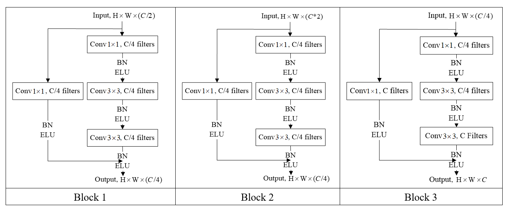
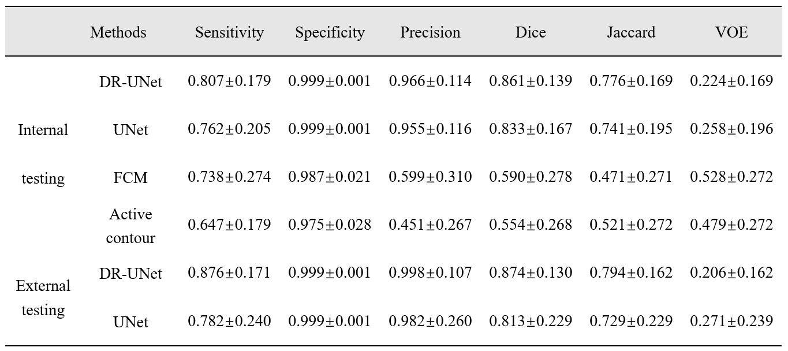

# DR-UNet: A robust deep learning segmentation method for hematoma volumetric detection in intracerebral hemorrhage

------

## Structure of DR-UNet

This is an implementation of  DR-UNet on Python 3.6, Keras, and TensorFlow2.0. DR-UNet consists of an encoding (down-sampling) path and a decoding (up-sampling) path. The entire workflow of our computational analysis. The entire workflow of our calculation and analysis is shown in the figure below


The DR-UNet model structure is shown in the figure below.


To increase the segmentation performance of the model, three reduced dimensional residual convolution units (RDRCUs) were developed to replace the traditional convolution layer. The three convolution blocks are illustrated in the following figure. The three RDRCUs have two branches (main branch and side branch) to process the input characteristics continuously.



## Experimental results of hematoma segmentation

We first trained DR-UNet to recognize the hematoma region in patients. The performance was evaluated on two testing datasets (internal and external) using the following criteria: i) sensitivity, ii) specificity, iii) precision, iv) Dice, v) Jaccard and vi) VOE (details in the Methods section). Moreover, we compared DR-UNet with UNet, FCM and active contours. In all four methods, segmentation labeling was considered the ground truth standard (details in the Methods section). The main calculation results are shown in the figure and table below.

As shown in the table below, results of sensitivity, specificity, precision, Dice, Jaccard and VOE by four methods in the internal testing and the external testing dataset.



Figure A shows the boxplots for the performance of the DR-UNet models and the other three methods for the segmentation and detection of ICHs on the two testing datasets. The internal testing dataset in the retrospective dataset was enriched to include all ICH subtypes. In Figure B, four different types of hematomas were included, and we visually presented a performance comparison among the DR-UNet, UNet, FCM and active contour methods.


## Irregularly shaped and epidural hematoma

Results of hematoma volumetric analysis in (A) irregularly shaped hematoma group and (B) subdural and epidural hematoma group. Input ICH images with manual segmentation were denoted by red line. The segmented outputs of the DR-UNet model were denoted by blue lines, the segmented outputs of the UNet were denoted by green lines.


Four examples of ICH segmentation in the subdural and epidural hematomas with original images and partially enlarged image in the prospective dataset. 


Four examples of ICH segmentation in the irregular-shaped hematomas with original images and partially enlarged image in the prospective dataset. 


## Calculate the hematoma volume experiment

The hematoma volumetric analysis by DR-UNet, UNet and Coniglobus method. A. The diagnoses of HVs were presented by ground truth and three different methods. B. The correlation plots among ground truth and three different methods. C. The error curves of three methods were plotted. The error curves of three methods were plotted. They were the error of {ground truth – the measurement by DR-UNet}, the error of {ground truth – the measurement by UNet} and the error of {ground truth – the measurement by Coniglobus formula}, respectively. D. The results of RMSE, SD, MAE and averaged time (second/scan).


## Getting Started

- [data.py](drunet/data.py)  Used to make your own dataset. Making your own dataset needs to satisfy having original images and the ground truth images. The completed dataset is a unique data format of tensorflow. 

  ```python
  from data import make_data
  
  # make tfrecords datasets
  make_data(image_shape, image_dir, mask_dir, out_name, out_dir)
  
  # get tfrecords datasets
  dataset = get_tfrecord_data(
      tf_record_path, tf_record_name, data_shape, batch_size=32, repeat=1, shuffle=True)
  ```

- [loss.py](drunet/loss.py)  According to the characteristics of the cerebral hematoma dataset, in order to obtain higher segmentation accuracy. We use binary cross entropy with dice as the loss function of DR-Unet.

- [module.py](drunet/module.py) This file contains several auxiliary functions for image processing.

- [utils.py](drunet/utils.py) This python file contains several auxiliary functions for file operations.

- [performance.py](drunet/performance.py) In order to evaluate the segmentation performance of the model, this file contains auxiliary functions for the calculation of several common segmentation indicators.

- [drunet.py](drunet/model/dr_unet.py) This file contains the specific implementation of DR-UNet and three reduced dimensional residual convolution units (RDRCUs).

  ```python
  from model import dr_unet
  
  model = dr_unet.dr_unet(input_shape=(256, 256, 1))
  model.summary()
  ```

- [segment.py](drunet/segment.py) This file shows how to train, test and verification DR-UNet on your own dataset. Including hematoma segmentation and hematoma volume estimation.

  ```python
  import pathlib
  
  # Parameter configuration
  parser = argparse.ArgumentParser(description="Segment Use Args")
  parser.add_argument('--model-name', default='DR_UNet', type=str)
  parser.add_argument('--dims', default=32, type=int)
  parser.add_argument('--epochs', default=50, type=int)
  parser.add_argument('--batch-size', default=16, type=int)
  parser.add_argument('--lr', default=2e-4, type=float)
  
  # Training data, testing, verification parameter settings
  parser.add_argument('--height', default=256, type=int)
  parser.add_argument('--width', default=256, type=int)
  parser.add_argument('--channel', default=1, type=int)
  parser.add_argument('--pred-height', default=4 * 256, type=int)
  parser.add_argument('--pred-width', default=4 * 256, type=int)
  parser.add_argument('--total-samples', default=5000, type=int)
  parser.add_argument('--invalid-samples', default=1000, type=int)
  parser.add_argument('--regularize', default=False, type=bool)
  parser.add_argument('--record-dir', default=r'', type=str, help='the save dir of tfrecord')
  parser.add_argument('--train-record-name', type=str, default=r'train_data', 
                      help='the train record save name')
  parser.add_argument('--test-image-dir', default=r'', type=str, 
                      help='the path of test images dir')
  parser.add_argument('--invalid-record-name', type=str, default=r'test_data', 
                      help='the invalid record save name')
  parser.add_argument('--gt-mask-dir', default=r'', type=str, 
                      help='the ground truth dir of validation set')
  parser.add_argument('--invalid-volume-dir', default=r'', type=str, 
                      help='estimation bleeding volume')
  args = parser.parse_args()
  
  
  segment = Segmentation(args)
  # start training
  segment.train() 
  # predict hematoma volume
  segment.predict_blood_volume(input_dir, save_dir, calc_nums=-1, dpi=96, thickness=0.45)
  ```

  [train_segment.py](drunet/train_segment.py) If you want to train the segmentation model, you can run this file directly after filling in the data path.
  
  [predict_segment.py](drunet/predict_segment.py) If you want to predict the segmentation result, you can run this file directly after filling in the ct images path.
  
  [predict_volume.py](drunet/predict_volume.py) If you want to predict the complete hematoma volume of a patient, after filling in the path, then you can run this file,
  
  [test_performance.py](drunet/test_performance.py) If you want to understand the segmentation performance of the model, you need to fill in the relevant path first, and then run this file.

## Requirements

Python 3.6, TensorFlow 2.1 and other common packages listed in `requirements.txt`.

