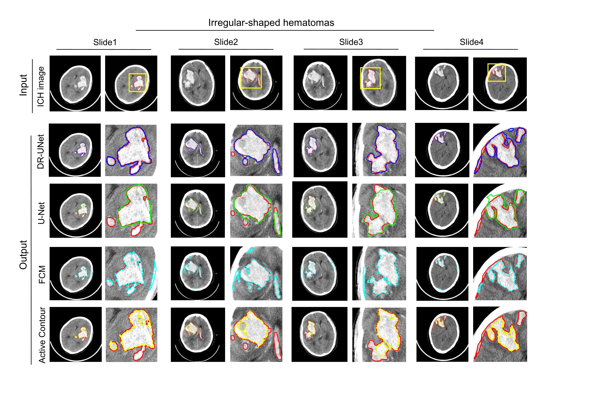

# DR-UNet: A robust deep learning segmentation method for hematoma volumetric detection in intracerebral hemorrhage

------

## Structure of DR-UNet

This is an implementation of  DR-UNet on Python 3.6, Keras, and TensorFlow2.0. DR-UNet consists of an encoding (down-sampling) path and a decoding (up-sampling) path. The model structure is shown in the figure below.

To increase the segmentation performance of the model, three reduced dimensional residual convolution units (RDRCUs) were developed to replace the traditional convolution layer. The three convolution blocks are illustrated in the following figure. The three RDRCUs have two branches (main branch and side branch) to process the input characteristics continuously.

 年后

## Getting Started

